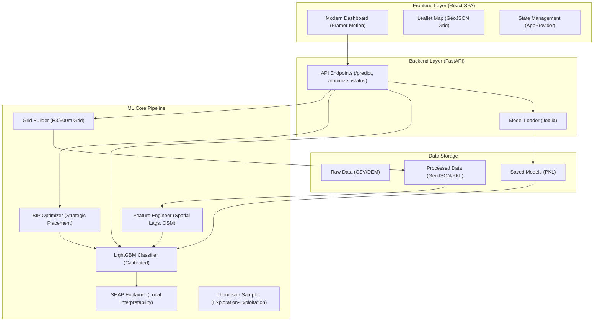
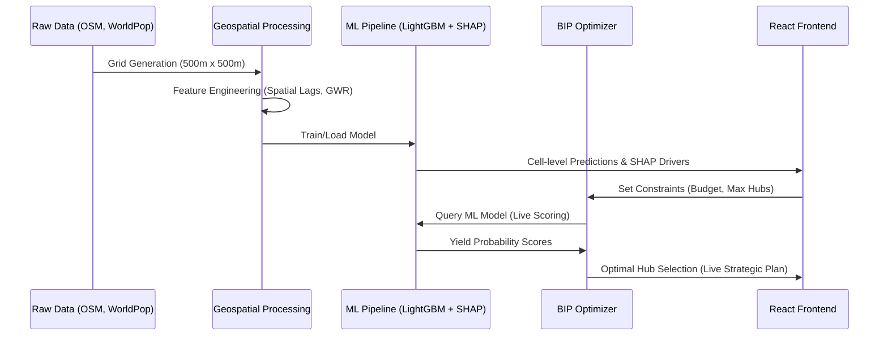

# BI-101: Geospatial Profitability Predictor — X-Pand

**X-Pand** is a premium, end-to-end geospatial profitability prediction system designed for **Tomato**, a food delivery company. It predicts the 6-month profitability of new service hubs by analyzing high-resolution delivery zone data over a 500m × 500m geospatial grid.

The system combines advanced spatial feature engineering, Geographically Weighted Regression (GWR), LightGBM classification with SHAP-based interpretability, and Binary Integer Programming (BIP) for strategic expansion — all served through a modern React SPA and a robust FastAPI backend.

---

## 🏛️ System Architecture

The following diagram illustrates the interaction between the modern React frontend, the FastAPI backend, and the core ML pipeline.



---

## 🔄 Data Workflow

The end-to-end pipeline from raw geospatial data to optimized strategic hub placement.



---

## 🚀 Key Features

- **Multi-City Support**: Dynamic grid generation and model scoring for Delhi, Jaipur, Kolkata, Indore, and Jalandhar.
- **High-Fidelity UI**: A modern, glassmorphic React SPA with fluid animations and interactive map visualizations.
- **ML Interpretability**: Full SHAP explanations for every prediction, identifying the top drivers of profitability.
- **Strategic Optimization**: Solve complex hub-placement problems under business constraints in real-time.
- **Financial ROI Modeling**: Synthesizes setup cost (CAPEX) per cell dynamically based on property metrics like population density and commercial activity (road density) to frame decisions in INR.
- **Live Monitoring**: Real-time status tracking for model caching and system health.

---

## 🛠️ Technology Stack

| Layer | Technologies |
|-------|--------------|
| **Core** | Python 3.9+, HTML5, TypeScript |
| **Backend** | FastAPI, Uvicorn, Pydantic |
| **Machine Learning** | LightGBM, Geographically Weighted Regression (MGWR), SHAP, Scikit-learn |
| **Spatial Processing** | GeoPandas, Shapely, PySal, WorldPop |
| **Optimization** | PuLP (Binary Integer Programming), Thompson Sampling |
| **Frontend** | React 19, Vite, Tailwind CSS, Framer Motion, Leaflet, Recharts |

---

## 🏗️ Getting Started

### 1. Install Dependencies

```bash
cd X-Pand
pip install -r requirements.txt
cd frontend
npm install
```

### 2. Start the Backend Server

```bash
# Return to root directory
cd ..
python -m uvicorn api.main:app --port 8000 --reload
```

### 3. Launch the React Dashboard

```bash
cd frontend
npm run dev
```

The application will be available at [http://localhost:5173](http://localhost:5173).

---

## 📂 Project Structure

```
X-Pand/
├── api/                # FastAPI application & model loaders
├── data/
│   ├── raw/            # Delivery zones & demographics
│   └── processed/      # Grid GeoJSON & feature pickles
├── frontend/           # Modern React/Vite SPA
│   ├── src/components/ # Reusable UI & Map components
│   └── src/pages/      # Dashboard and Home views
├── models/             # Serialized LightGBM & GWR models
├── src/                # Core ML pipeline & optimization logic
│   ├── bip_optimizer.py
│   ├── city_grids.py
│   ├── lgbm_model.py
│   └── explainer.py
├── notebooks/          # Data preparation & training walkthroughs
└── README.md
```

---

## 🏆 Performance Targets

| Metric | Target |
|--------|--------|
| **F1-Score** | > 0.80 on held-out test set |
| **Batch Scoring** | 10,000 grid cells scored in < 5 minutes |
| **BIP Optimization** | Optimal hub selection computed in < 60 seconds |
| **Interpretability** | Full SHAP explanations for every prediction |

---

Developed by the X-Pand Engineering Team.
